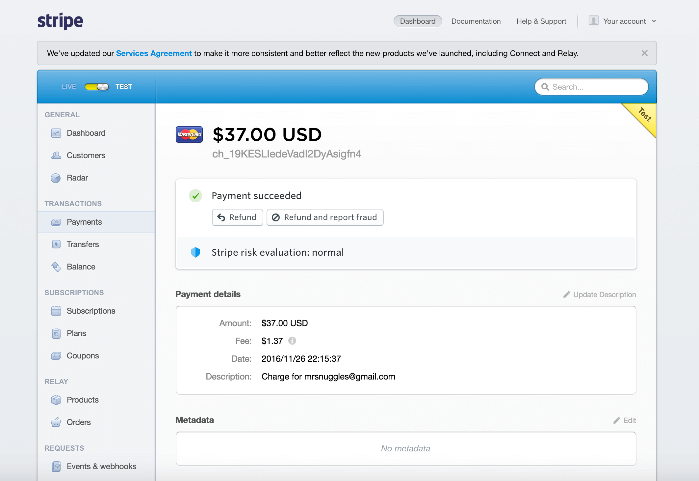

# E-Commerce Project
---
### Objective:
create an e-commerce site implementing angular on the front end and flask on the back-end

### Live Demo:

TBD
<!-- [Xmas Blackjack Game] (http://xmasblackjack.surge.sh/) -->

### Languages used:

* HTML
* CSS
* BOOTSTRAP
* Javascript
* AngularJS
* Python
* Flask
* PostgreSQL
* Stripe API - handling credit card payments

### Authors:

Carolyn Lam

### Routes (walk-through w/ screenshots):

##### 1. Home Page => '/'

  * The home page displays all the current products.
  * shows sign up and login links in nav bar

  

##### 2. Product Detail Page => '/product_detail/{product_id}'

  * The product detail displays the product information for one product. Product_id is unique to only that product
  * customer must be logged in to add product to cart

    ***Product Detail Page (w/o user logged in)***
    

    ***Product Detail Page (w/ user logged in)***
    

    ***Product Detail Page (w/ user logged in, adds item to cart)***
    

##### 3. Sign Up Page => '/signup'

  * Customers who are new to the site can create a new account
  * If passwords do not match, the user cannot proceed

  

##### 4. Login Page => '/login'

  * Customers who already have an account can login using their username and password
  * message displays if login info was incorrect

  

##### 5. Shopping Cart Page => '/shopping_cart'

  * Only registered users can access this page
  * The shopping cart lists all the products that the customer has added to their shopping cart

  

##### 6. Checkout Page => '/checkout'

  * features a shipping form - all required fields must be filled in order to proceed to payment
  * Stripe API handles the payment processing
  * message displays if customer hasn't entered all required fields

  ***Checkout Page***
  

  ***Checkout Page (payment checkout using STRIPE API)***
  

  ***Payment charge shows up in Stripe Account***
  

###### 7. Thank You Page => '/thanks'

  * Once a customer has paid for their order, they are redirected to this page
  * lets them know that their order has been received
  * also lets them know when they should be receiving their order

  

### Further Info:

The e-commerce site was built using HTML, CSS, and AngularJS on the front end and Flask on the back-end. I (Carolyn Lam) worked on the back-end part. Then I worked in a pair-programming session with Juan Cortes to build most of the front-end. Before starting the front-end we both had our own back-end code, so we decided to merge our code into one file. After creating the main functionality in the front-end, we each decided to continue building the e-commerce with our own personal touches and styling.

#### E-Commerce (Backend):

I first worked on the API back-end of the project. I created a PostgreSQL database and set up the tables we've need using a schema.

Then I set up all the API routes in a py file called server.py. Some of the routes required returning certain information from the database to the front-end. For instance, making a 'GET method' to '/api/products' returns information for all the products in the database that the front-end will use to render the home page. Additionally, these API routes also tested for errors and if an error had occurred, they were set up to return an error status code instead of a successful status code.

Also in the server.py file, I installed and imported some modules and features that the project would need. Some of them turned out to be new ones I hadn't yet worked with. For instance, I installed bcrypt for this project. Bcrypt is used to encrypt passwords so that passwords are stored safely in the database. So, in the case someone were to gain access into the database, all they would see of peoples' passwords would be their encrypted passwords. Another new feature I worked with was the uuid module. The uuid module is used to generate unique authentication tokens for new user sessions. Additionally, I also used Stripe's API to handle credit card charges (more on this later).

#### E-Commerce (Front-End):

After merging our back-end code, my partner and I started working on the front-end. We began by setting up our files and folders. We created a main js file called ecommerce.js that would handle the main front-end logic. At the top of this file we included angular and modules we'd be using such as 'ui.router' and 'ngCookies' (more on this later).

```
var app = angular.module('e_commerce_app', ['ui.router', 'ngCookies'])

```

In our ecommerce.js, we created an app.config that allowed us to set up different states. Each state has its own name, url, html file, and controller. We also created an app.factory, which is a function that returns an object. We had ours set up so that it returned an object called service which stores the different services that the factory provided.

### Sample Code:

* Below shows the code written for the Checkout Controller

```
app.controller('CheckoutController', function($scope, $state, $cookies, $rootScope, EC_Factory, $timeout) {

  EC_Factory.getOrderInfo($scope.shipping_info)
    .success(function(shopping_cart) {
      $scope.shopping_cart = shopping_cart.shopping_cart_products;
      $scope.total_price = shopping_cart.total_price
    });

    $scope.paymentCheckout = function() {
      // initialize $scope.address_line_2 to nothing otherwise it will be sent as undefined and this will cause an issue when trying to insert information into the database
      $scope.address_line_2 = ""
      // save user shipping info to an object
      $scope.shipping_info = {
        address: $scope.address,
        address_line_2: $scope.address_line_2,
        city: $scope.city,
        state: $scope.state,
        zip_code: $scope.zip_code,
      };
      // checks if any of the required fields in the shipping info form is undefined
      if ($scope.address === undefined || $scope.city === undefined ||
      $scope.state === undefined || $scope.zip_code === undefined) {
        // if any field is undefined, do not proceed to payment part of checkout
        $scope.continue = false;
        $scope.showMessage = true;
        $timeout(function() {
          $scope.showMessage = false;
        }, 3000);
      } else {
        // if none of the required fields is undefined, continue to payment part of checkout
        $scope.continue = true;
      }
      // continue to payment part of checkout
      if ($scope.continue) {
        var amount = $scope.total_price;
        var handler = StripeCheckout.configure({
          // publishable key
          key: 'pk_test_6ejpZxH0HdamRL9OQ2JymyQB',
          locale: 'auto',
          token: function callback(token) {
            // Make checkout API call here and send the stripe token to the back end
            // the back-end later uses the stripe token id to create a credit card charge
            EC_Factory.getCheckout($scope.shipping_info, token)
              .success(function(shopping_cart) {
                // redirect to thank you page
                $state.go('thanks');
              });
          }
        });
        // this actually opens the popup modal dialog where users can enter payment info
        handler.open({
          name: 'BobblyWobbly',
          description: 'Collect them all - one Bobblehead at a time',
          amount: amount * 100
        });
      }
    };

});
```

Refactored Code Example 1
  * Before I created 2 different services inside app.factory
  * the addToCart service makes an AJAX call to the backend to add a new product in the customer's shopping cart
  * the removeFromCart service makes an AJAX call to the backend to remove a product from the customer's shopping cart
  * looking closely at the 2 services, the only difference is in the service name and the value of the variable addToCart is either 'Add' or 'Remove'

```

service.addToCart = function(product_id) {
  var addToCart = 'Add';
  var url = '/api/shopping_cart';

  return $http({
    method: "POST",
    url: url,
    data: {
      auth_token: $cookies.getObject('cookieData').auth_token,
      customer_id: $cookies.getObject('cookieData').user["id"],
      product_id: product_id,
      add_remove: addToCart
    }
  });
}

service.removeFromCart = function(product_id) {
  var addToCart = 'Remove';
  var url = 'api/shopping_cart';

  return $http({
    method: "POST",
    url: url,
    data: {
      auth_token: $cookies.getObject('cookieData').auth_token,
      customer_id: $cookies.getObject('cookieData').user["id"],
      product_id: product_id,
      add_remove: addToCart
    }
  });
}
```
Refactored Code Example 1 Cont.

  * I refactored the code above into 1 service method that is more versatile
  * it takes in 2 parameters: product_id (product id) and add_or_delete (value is either 'Add' or 'Remove')
  * updated the service name to updateCart

```
service.updateCart = function(product_id, add_or_delete) {
  // add_or_delete is a string value of either 'Add' or 'Delete'
  // the back-end will either add or delete the item depending on this value
  var url = '/api/shopping_cart';

  return $http({
    method: "POST",
    url: url,
    data: {
      auth_token: $cookies.getObject('cookieData').auth_token,
      customer_id: $cookies.getObject('cookieData').user["id"],
      product_id: product_id,
      add_remove: add_or_delete
    }
  });
}
```

###### Further explanation on AngularJS modules used in this project:

  1. The **'ui.router'** is a routing framework that allows us to organize our routes into different states.
  2. The module **'ngCookies'** is used to store a customer's data during the time they are logged into the site. Even when the page is refreshed while the user is logged in, the customer's data (that is saved in the cookie) still exists and allows the user to still be logged in.

###### Further explanation on Stripe API used in this project:
  1. Stripe API is a service that allows users to make payments online
  2. in the front-end, we pass the stripe token data to the back-end
  2. in the back-end we set up a stripe secret key
    * (to obtain a stripe secret key, I made an account on stripe.com)
  3. since the key is not meant to be shown to the public, I hid the value of my secret key inside my .env file and used .gitignore to ignore the .env from the public
  * then you can proceed to create a charge object, which gets sent to the stripe API
  * you can see if the charge was made by checking your account on stripe.com

```
# Stripe Secret key
    stripe.api_key = os.environ.get("STRIPE_SECRET_KEY")

    # to create a credit card charge, create a charge object
    credit_card_charge = stripe.Charge.create(
      amount= total_price * 100,
      currency="usd",
      source= stripe_token, # obtained with Stripe.js
      description="Charge for %s" % stripe_email
    )
```


### What To Do Next:

* create a user page (shows user info and keeps track of their past purchases)
* update product detail page to allow users the option of selecting a certain amount of product instead of having to click the 'add to cart' button once for each product
* update shopping cart to reflect the same product in one row with a property called quantity that keeps track of how many there are of it
* create a search bar where users can search for products
* continue user testing - handle all errors


<!-- My partner and I began the project starting from the back end. First, we began with a database schema and set up all the routes we'd be using. We also installed and imported a couple of new things we hadn't worked with before, one of them being the bcrypt, which is used to encrypt passwords to safely store passwords in the database. We also imported the uuid module to generate unique authentication tokens for new user sessions. -->

<!-- Then we installed bcrypt to encrypt passwords to safely store passwords in the database. We also imported the uuid module to generate unique authentication tokens for new user sessions. -->

<!-- I decided to create an e-commerce site that sells bobbleheads because I think they're fun and humorous products that make people smile and laugh. -->
