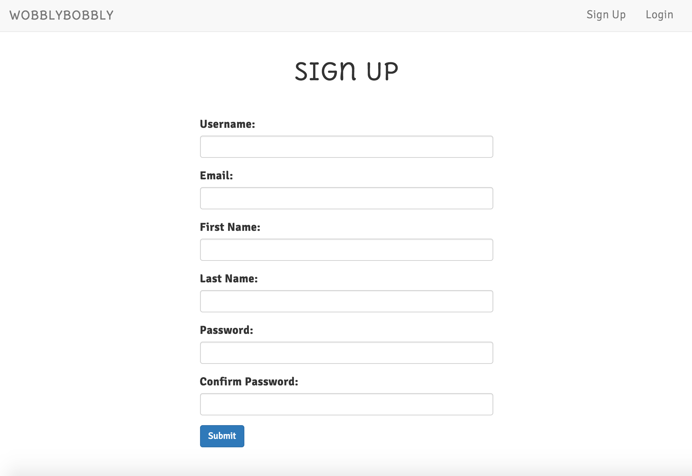
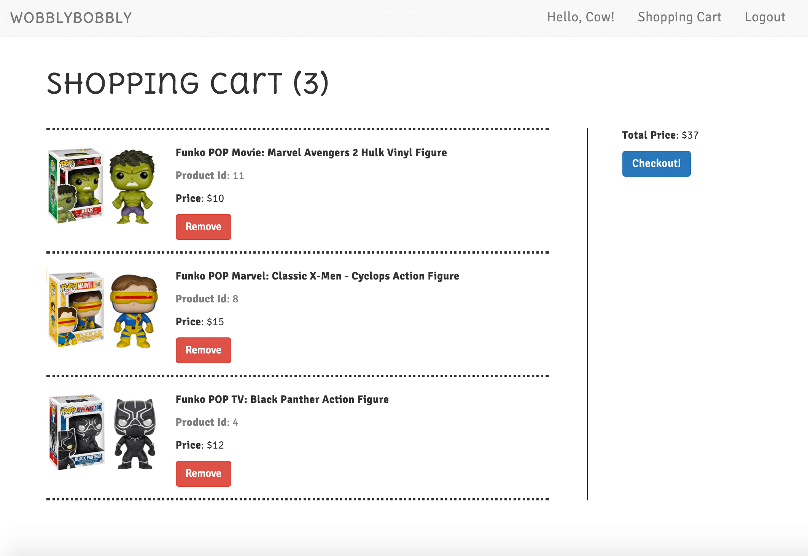
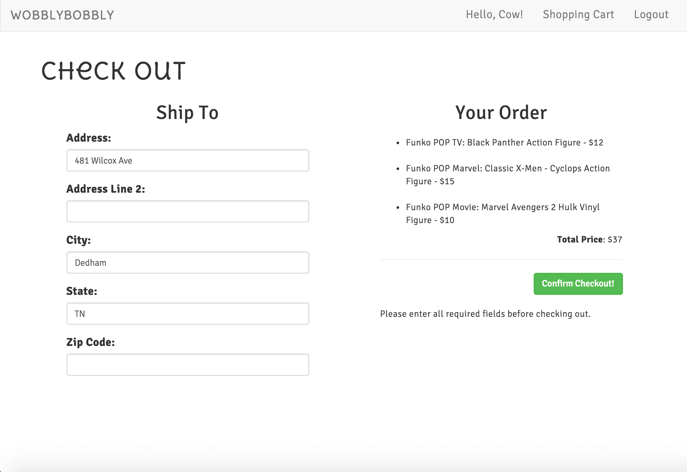

# E-Commerce Project
---
<!-- #### Objective:
create an e-commerce site implementing angular on the front end and flask on the back-end -->

### What is it?

The e-commerce site was built using HTML, CSS, and AngularJS on the front end and Flask on the back-end. Juan and I (Carolyn Lam) worked together in a pair-programming session to create most of the back-end and front-end. Then we each decided to continue building the e-commerce with our own personal touches and styling.

The project was built starting from the back end. My partner and I created our database and set up all the routes we'd be using. Then we installed bcrypt to encrypt passwords to safely store passwords in the database. We also imported the uuid module to generate unique authentication tokens for new user sessions.

I decided to create an e-commerce site that sells bobbleheads because I think they're fun and humorous products that make people smile and laugh.

### Live Demo:

TBD
<!-- [Xmas Blackjack Game] (http://xmasblackjack.surge.sh/) -->

### Languages used:

* HTML
* CSS
* BOOTSTRAP
* Javascript
* AngularJS
* Python
* Flask
* PostgreSQL
* Stripe API - handling credit card payments

### Authors:

Carolyn Lam

### Routes (walk-through w/ screenshots):

##### 1. Home Page => '/'

  * The home page displays all the current products.
  * shows sign up and login links in nav bar

  

##### 2. Product Detail Page => '/product_detail/{product_id}'

  * The product detail displays the product information for one product. Product_id is unique to only that product
  * customer must be logged in to add product to cart

    ***Product Detail Page (w/o user logged in)***
    

    ***Product Detail Page (w/ user logged in)***
    

    ***Product Detail Page (w/ user logged in, adds item to cart)***
    

##### 3. Sign Up Page => '/signup'

  * Customers who are new to the site can create a new account

  

##### 4. Login Page => '/login'

  * Customers who already have an account can login using their email address and password
  * message displays if login info was incorrect

  

##### 5. Shopping Cart Page => '/shopping_cart'

  * Only registered users can access this page
  * The shopping cart lists all the products that the customer has added to their shopping cart

  

##### 6. Checkout Page => '/checkout'

  * features a shipping form - all required fields must be filled in order to proceed to payment
  * Stripe API handles the payment processing
  * message displays if customer hasn't entered all required fields

  ***Checkout Page***
  

  ***Checkout Page (payment checkout using STRIPE API)***
  

  ***Payment charge shows up in Stripe Account***
  

###### 7. Thank You Page => '/thanks'

  * Once a customer has paid for their order, they are redirected to this page
  * lets them know that their order has been received
  * also lets them know when they should be receiving their order

  

### Sample Code:
